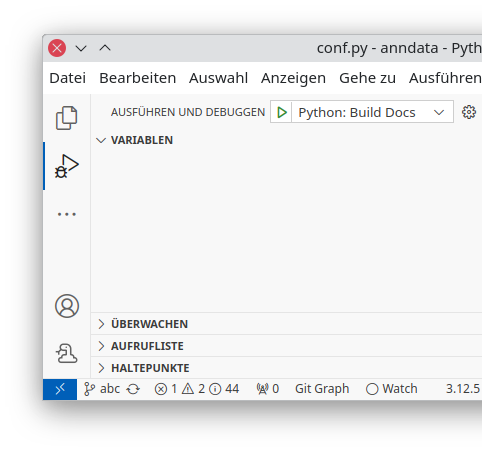
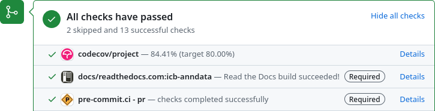
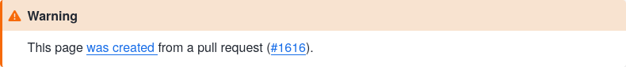

<!-- _paginate: skip -->

<!-- Header link: important! -->
<!-- Follow along if you’re quick, later interactive -->
<!-- QR URL: https://api.qrserver.com/v1/create-qr-code/?format=svg&data=https://scverse.org/cookiecutter-scverse-presentation/ -->


# [scverse cookiecutter template][template]

Follow along: [scverse.org/
cookiecutter-scverse-presentation][pres]

[template]: https://cookiecutter-scverse-instance.readthedocs.io/en/latest/template_usage.html
[pres]: https://scverse.org/cookiecutter-scverse-presentation/

---

# tool installs

* Install using a package manager or installer:

  - [`code`][], [`hatch`][], & [`git`][]
  - [`uv`][] or [`pipx`][]

* Install using a package manager, `pipx`, or `uv`:

  - `cruft` & `pre-commit`

    ```console
    $ pipx install cruft pre-commit  # or
    $ uv tool install cruft pre-commit
    ```

[`code`]: https://code.visualstudio.com/download
[`hatch`]: https://hatch.pypa.io/latest/install/
[`git`]: https://github.com/git-guides/install-git
[`uv`]: https://docs.astral.sh/uv/getting-started/installation/
[`pipx`]: https://pipx.pypa.io/stable/installation/

---

# creating the project

```console
$ cruft create https://github.com/scverse/cookiecutter-scverse
  project_name (project-name): myproj
  […]
$ code myproj
```


---

# environment management

Hatch envs [basic usage][hatch envs]:

```console
$ hatch run [env:]command [...args] # e.g. `… docs:build -T`
$ hatch test [...args]
$ hatch env remove <name> # or `hatch env prune` for all
$ hatch find hatch-test
~/.local/share/hatch/env/virtual/myproj/FsejNibV/hatch-test.py3.12
[…]
```

Tell VS Code:

<kbd>⌘</kbd>|<kbd>^</kbd>+<kbd>⇑</kbd>+<kbd>P</kbd> → <kbd>Python: Select Interpreter</kbd>

[hatch envs]: https://hatch.pypa.io/latest/tutorials/environment/basic-usage/

---

# running tests

```console
$ hatch test --help
[…]
Options:
  -r, --randomize
  -p, --parallel
  -c, --cover
  -a, --all
  -py, --python=X.Y
  -i, --include=VAR=VAL
  -x, --exclude=VAR=VAL
  -s, --show
…otherwise same as `pytest`
```


---

# building docs

```console
$ hatch run docs:build
$ hatch run docs:open
$ hatch run docs:clean
```

See <samp>pyproject.toml</samp>:

```toml
[tools.hatch.envs.docs]
scripts.build = "..."
...
```



---

# formatting and linting

VS Code:

```json
{
  "[python]": {
    "editor.formatOnSave": true,
    "editor.defaultFormatter": "charliermarsh.ruff",
    "editor.codeActionsOnSave": { ... },
  }, ...
}
```

CLI: `pre-commit` (or `hatch run pre-commit`)

<!-- Installing pre-commit globally is preferred -->

```console
$ pre-commit install # `git commit` hook
$ pre-commit run --all-files
```

---

# existing project

<!-- simple: pure-python, one package -->

* Simple project

  1. Instantiate template
  2. Replace <samp>src/*</samp> directory with your package
  3. Edit `[project]` table in <samp>pyproject.toml</samp>

* Complex project

  1. Step by step PRs: formatter, …
  2. We can help!

---

<!-- _color: var(--color-accent) -->
<!-- _backgroundColor: black -->

# follow along

---

# committing code

<!-- No need to do this live, time should be mostly up here -->

- Use PRs, don’t push to `main`
- Set up [pre-commit.ci][], [codecov.io][] on
  github.com/&lt;you>/&lt;yourpackage>/settings/installations



[pre-commit.ci]: https://pre-commit.ci/
[codecov.io]: https://codecov.io/

---

# ReadTheDocs

- Set up [readthedocs.org][] and its [PR previews][]:



[readthedocs.org]: https://docs.readthedocs.io/en/stable/intro/import-guide.html
[PR previews]: https://docs.readthedocs.io/en/stable/guides/pull-requests.html

---

<!-- _color: var(--color-accent) -->
<!-- _backgroundColor: black -->

# Thank you
